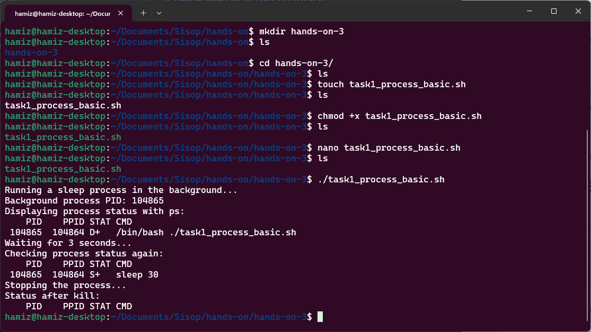
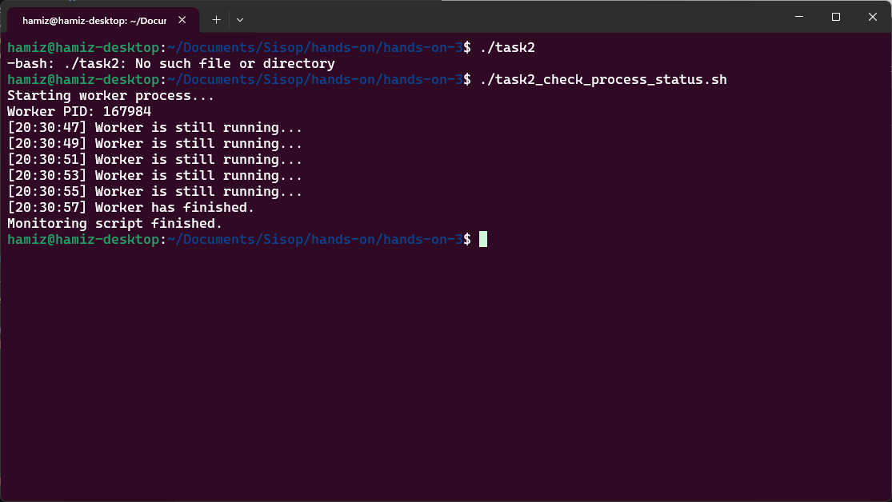
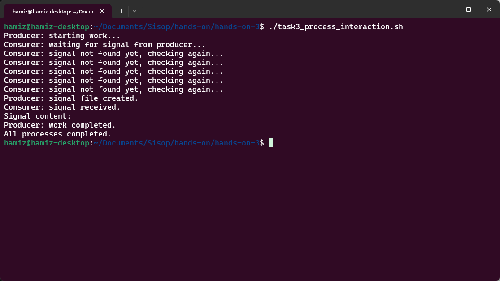
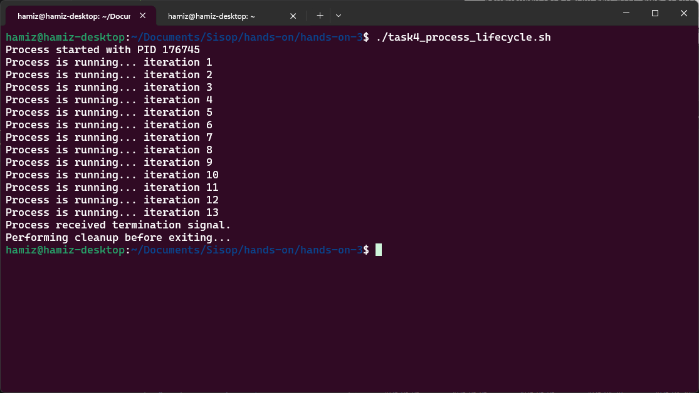
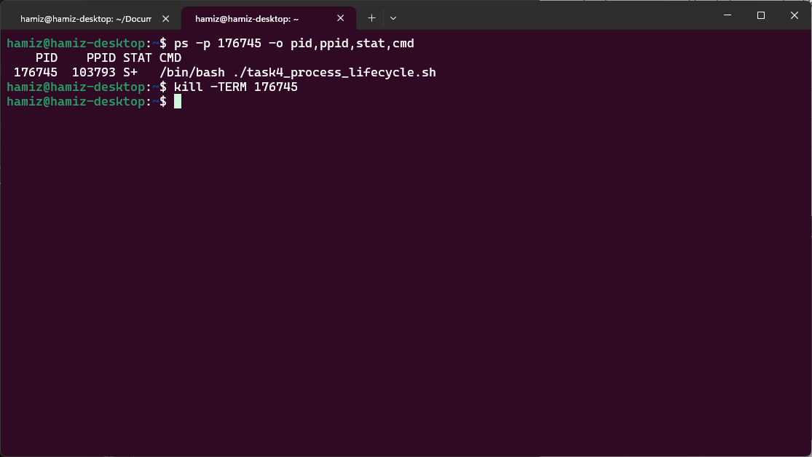
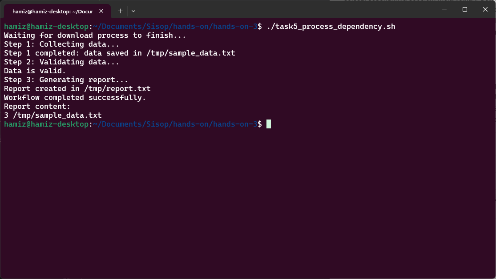

# Laporan Hands-On 3: Process Lifecycle

|    NRP     |           Nama             |
| :--------: |       :------------:       |
| 5025251246 | Hamizan Rifqi Afandi       |

---

Pada hands-on ini, konsep dasar process pada sistem operasi dibahas lewat serangkaian *shell script* yang bertujuan pada pembuatan process, observasi PID, monitoring status, komunikasi antarprocess, penganganan signal, dan dependency workflow.

---

## Creating and Observing a Simple Process

Segmen ini memperkenalkan mengenai pembuatan process dan observasi PID untuk mengetahui identitasnya. Tujuan utama dari segmen ini yaitu menunjukkan bahwa sebuah process dapat dipindahkan ke background, diamaati statusnya, lalu diberhentikan melalui command pengguna.

File `task1_process_basic.sh` mengimplementasikan hal tersebut melalui dijalankannya perintah `sleep 30 &` untuk membawanya ke background selama 30 detik. Kemudian PID dari process tersebut di catat ke variabel `PID_BG` menggunakan `$!`, lalu diamati dengan command `ps -p -o`. Script lalu menunggu sepanjang 3 detik, membunuh process tersebut menggunakan signal kill dengan command `kill`, lalu memeriksa kembali status process.

### Kesimpulan

Dengan background execution, observasi PID, dan terminasi, mahasiswa dapat melihat bahwa process memiliki lifecycle yang dapat diikuti dan dikelola sejak tahap paling dasar.

| Komponen | Isi |
| :--- | :--- |
| Filename | `task1_process_basic.sh` |
| Tools | `echo`, `sleep`, `$!`, `ps`, `kill` |

### Snapshots Eksekusi

---

## Monitoring the Status of Another Process

Dalam beberapa simple system, suatu process terkadang sering membutuhkan untuk mengetahui apabila suatu process masih berjalan, telah berhenti, atau telah gagal. Contoh nyatanya bisa dengan mengimplementasikan script monitoring untuk memastikan bahwa suatu service masih aktif.

File `task2_check_process_status.sh` mengimplementasikan hal tersebut melalui dijalankannya imitasi process worker `sleep 10 &` untuk membawanya ke background selama 10 detik. Kemudian PID dari process tersebut di catat ke variabel `WORKER_PID` menggunakan `$!`, lalu memeriksa keberadaan process dengan command `kill -0` dengan jeda 2 detik. Apabila worker masih berjalan, process mengoutput bahwa worker masih berjalan, sedangkan apabila tidak, process mengoutput bahwa telah berhenti dan keluar dari loop.

### Kesimpulan

Status sebuah process dapat dipantau dari script lain tanpa harus menghentikan process tersebut. Dengan `kill -0`, process dapat melakukan cek keberadaan suatu process secara ringan dan menggunakan hasilnyauntuk mengatur alur program. Segmen ini memperlihatkan dasar monitoring process yang nanti sangat berguna pada service supervision dan workflow automation.

| Komponen | Isi |
| :--- | :--- |
| Filename | `task2_check_process_status.sh` |
| Tools | `echo`, `sleep`, `$!`, `kill` |

### Snapshots Eksekusi

---

## Interacting Between Processes Using a Signal File

Segmen ini memperkenalkan komunikasi antar proses menggunakan file sebagai media sederhana untuk koordinasi. Tujuan utamanya yaitu menunjukkan bahwa dua proses dapat berjalan bersamaan, saling berbagi informasi, dan melakukan sinkronisasi tanpa mekanisme komunikasi antar proses yang rumit seperti pipe atau socket.

File `task3_process_interaction.sh` mengimplementasikan dua fungsi: `producer` dan `consumer`. `producer` mensimulasikan proses yang bekerja selama 5 detik, lalu membuat file sinyal di `/tmp/process_done.signal` sebagai tanda bahwa pekerjaannya selesai. `consumer` secara periodik memeriksa keberadaan file tersebut menggunakan loop `while [ ! -f "$SIGNAL_FILE" ]`. Ketika file ditemukan, `consumer` membaca isinya dan menampilkannya. Kedua proses dijalankan sebagai background process (`producer &` dan `consumer &`), kemudian `wait` digunakan untuk memastikan keduanya selesai sebelum skrip membersihkan file sinyal.

### Kesimpulan

Dengan pendekatan file-based signaling, mahasiswa dapat memahami bahwa komunikasi antar proses tidak selalu membutuhkan mekanisme yang rumit. File system dapat berfungsi sebagai media komunikasi sederhana yang efektif untuk koordinasi dan sinkronisasi dasar antara proses yang berjalan secara konkuren.

| Komponen | Isi |
| :--- | :--- |
| Filename | `task3_process_interaction.sh` |
| Tools | `echo`, `sleep`, `rm`, `&`, `wait`, `cat`, file system (`/tmp`) |

### Snapshots Eksekusi

---

## Observing the Process Lifecycle (start, running, stop, terminated)

Segmen ini memperkenalkan siklus hidup proses secara lengkap, mulai dari proses dibuat, berjalan, menerima sinyal, hingga dihentikan. Tujuan utamanya yaitu menunjukkan bahwa sebuah proses tidak hanya "berjalan" atau "berhenti", tetapi memiliki tahapan hidup yang dapat diamati dan dikendalikan, termasuk kemampuan untuk melakukan pembersihan (cleanup) sebelum terminasi.

File `task4_process_lifecycle.sh` mengimplementasikan proses dengan infinite loop yang mensimulasikan proses aktif berjalan terus menerus. Script ini menggunakan `trap cleanup SIGTERM SIGINT` untuk menangkap sinyal penghentian (SIGTERM dari `kill` atau SIGINT dari `Ctrl+C`). Ketika sinyal diterima, fungsi `cleanup()` dipanggil untuk melakukan pembersihan sebelum proses keluar. Variabel `$$` digunakan untuk menampilkan PID dari proses script itu sendiri. Dari terminal terpisah, pengguna dapat mengamati status proses menggunakan `ps -p <PID> -o pid,ppid,stat,cmd` dan mengirim sinyal terminasi dengan `kill -TERM <PID>`.

### Kesimpulan

Dengan mekanisme signal handling menggunakan `trap`, mahasiswa dapat memahami bahwa proses memiliki siklus hidup yang dapat diobservasi dan dikendalikan secara eksplisit. Konsep cleanup sebelum terminasi sangat penting karena menunjukkan bahwa menghentikan proses dengan benar seringkali membutuhkan tindakan pembersihan, bukan sekadar mematikannya secara paksa.

| Komponen | Isi |
| :--- | :--- |
| Filename | `task4_process_lifecycle.sh` |
| Tools | `trap`, `$$`, `echo`, `sleep`, `ps`, `kill` |

### Snapshots Eksekusi

**Terminal 1 - Menjalankan proses:**

**Terminal 2 - Observasi dan pengiriman sinyal:**

---

## Inter-Process Dependency in a Simple Workflow

Segmen ini memperkenalkan konsep dependensi antar proses dalam sebuah alur kerja (workflow). Tujuan utamanya yaitu menunjukkan bahwa suatu proses mungkin bergantung pada hasil dari proses lain, dan Bash dapat digunakan untuk mengatur urutan eksekusi serta memeriksa keberhasilan setiap langkah sebelum melanjutkan ke langkah berikutnya.

File `task5_process_dependency.sh` mengimplementasikan tiga langkah dalam sebuah workflow: `download_data` (mengumpulkan data), `validate_data` (memvalidasi data), dan `generate_report` (membuat laporan). Proses `download_data` dijalankan di background dengan PID-nya dicatat, kemudian `wait $PID_DOWNLOAD` digunakan untuk memastikan proses pengumpulan data selesai sepenuhnya sebelum melanjutkan. Setelah itu, `validate_data` memeriksa apakah file data tersedia dan tidak kosong, mengembalikan exit status (`0` untuk sukses, `1` untuk error). Jika validasi berhasil (`$? -eq 0`), maka `generate_report` dijalankan untuk membuat laporan; jika gagal, workflow berhenti dan menampilkan pesan error.

### Kesimpulan

Dengan mekanisme `wait` untuk sinkronisasi dependensi dan pengecekan exit status untuk validasi hasil, mahasiswa dapat memahami bahwa Bash mampu membangun workflow yang terstruktur, aman, dan memiliki kontrol ketergantungan yang jelas antar proses. Konsep ini menjadi fondasi penting untuk memahami otomatisasi sistem, job scheduling, dan pipeline data di lingkungan yang lebih kompleks.

| Komponen | Isi |
| :--- | :--- |
| Filename | `task5_process_dependency.sh` |
| Tools | `echo`, `sleep`, `wait`, `$?`, `if-else`, file system (`/tmp`), `wc -l` |

### Snapshots Eksekusi

