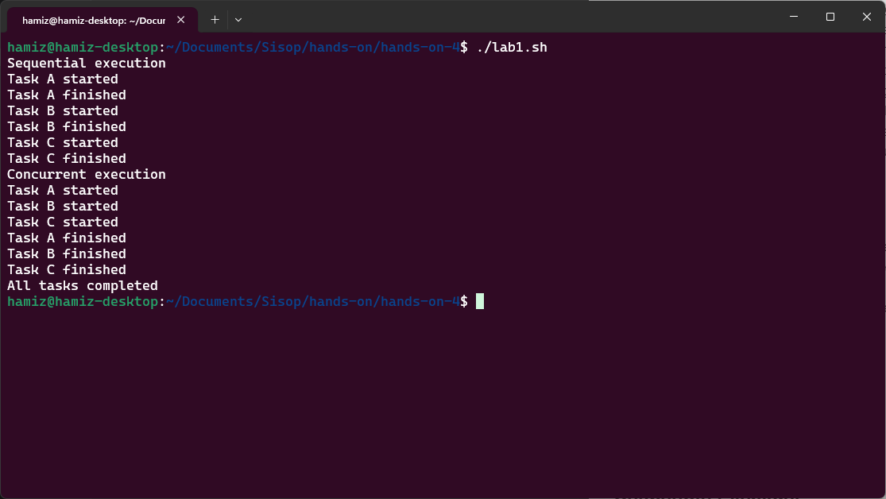
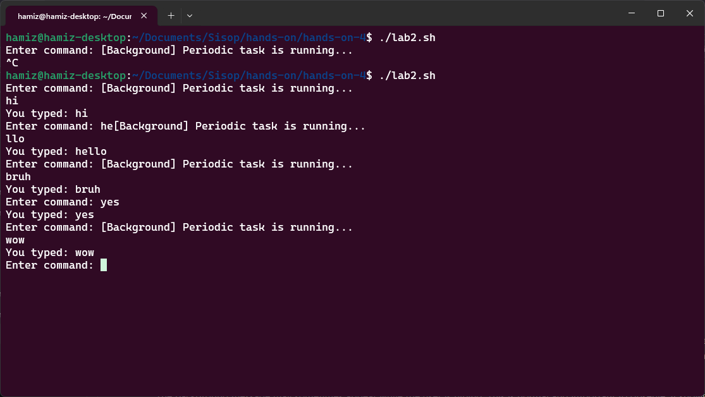
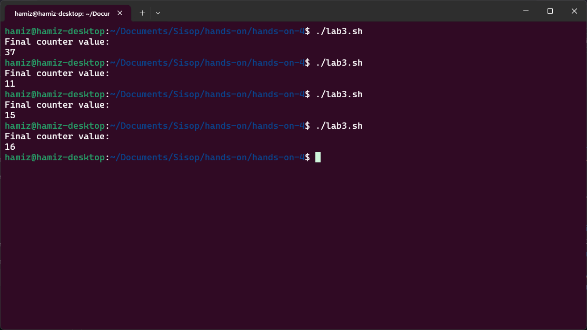
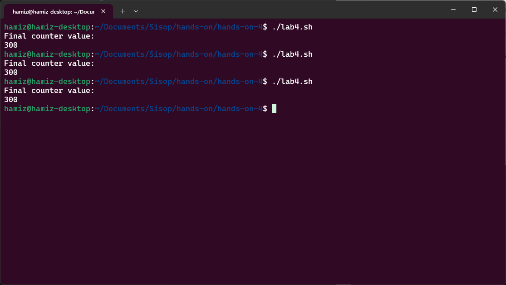
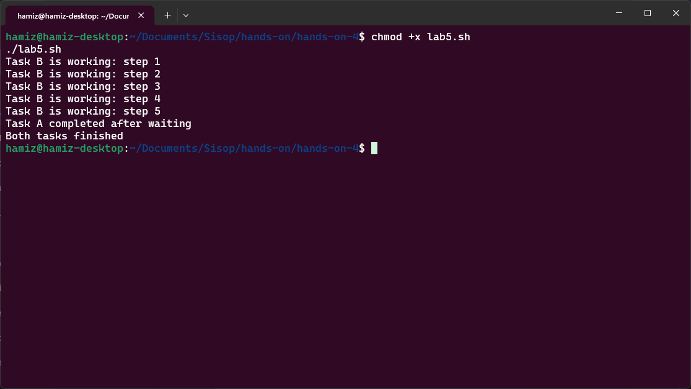
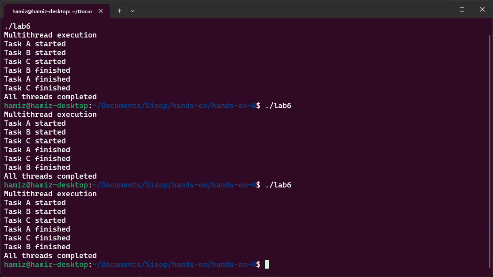
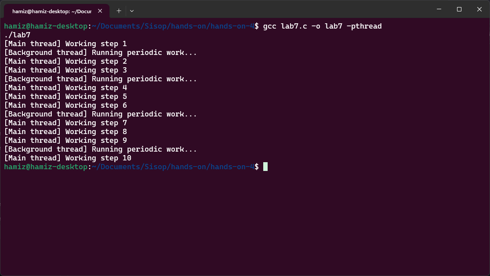
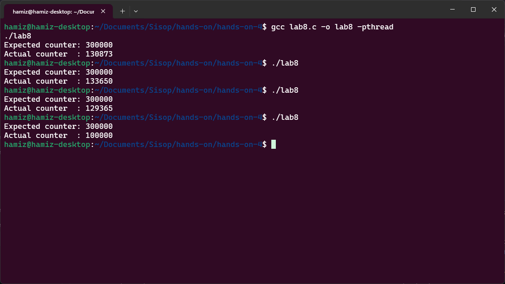
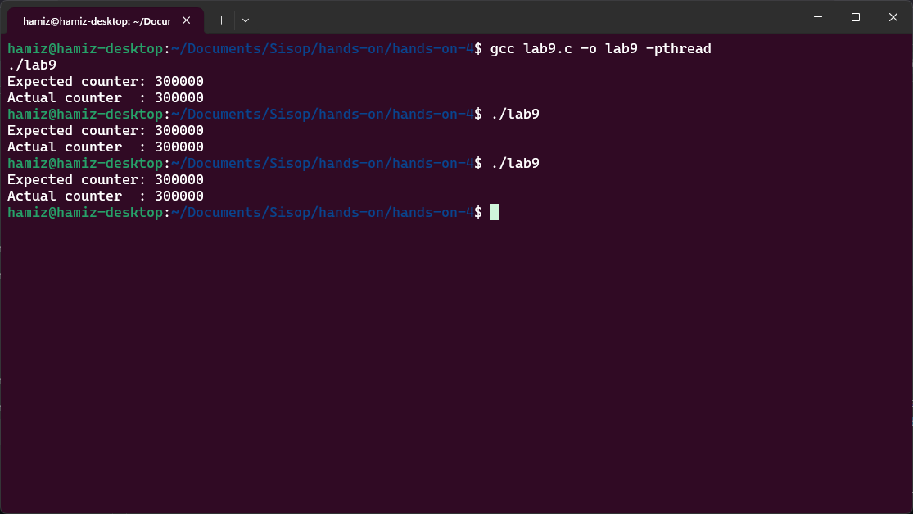
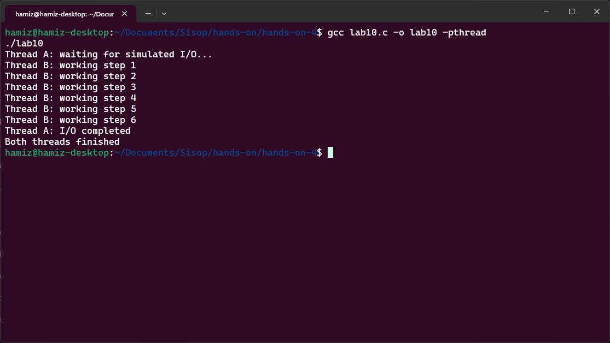

# Laporan Hands-On 4: Threads and Concurrency (Bash & C)

|    NRP     |           Nama             |
| :--------: |       :------------:       |
| 5025251246 | Hamizan Rifqi Afandi       |

---

Tujuan dari lab ini adalah untuk membantu siswa membandingkan eksekusi sekuensial dan eksekusi bersamaan dengan cara yang sederhana dan mudah dilihat. Eksekusi berurutan berarti satu tugas harus selesai sebelum tugas berikutnya dimulai. Hal ini mudah dipahami dan diprediksi, namun dapat membuang-buang waktu ketika tugas bersifat independen atau menghabiskan banyak waktu untuk menunggu. Eksekusi serentak memungkinkan beberapa tugas mengalami kemajuan selama periode waktu yang tumpang tindih.

---

## Lab 1 (Bash): Sequential vs Concurrent Execution

Segmen ini membandingkan eksekusi sekuensial (berurutan) dengan eksekusi konkuren (bersamaan) menggunakan Bash. Tujuan utamanya adalah menunjukkan bahwa tugas-tugas independen dapat dijalankan secara bersamaan untuk menghemat waktu, berbeda dengan eksekusi berurutan yang menyelesaikan satu tugas sebelum beralih ke tugas berikutnya.

File `lab1.sh` mengimplementasikan sebuah fungsi `task()` yang mensimulasikan pekerjaan dengan `sleep 3` (menunggu 3 detik). Pada bagian sekuensial, fungsi dipanggil secara berurutan: `task A`, `task B`, `task C` — sehingga total waktu yang dibutuhkan sekitar 9 detik. Pada bagian konkuren, ketiga tugas dijalankan sebagai background process menggunakan `task A &`, `task B &`, `task C &`, kemudian `wait` digunakan untuk menunggu seluruh background process selesai. Total waktu yang dibutuhkan hanya sekitar 3 detik karena ketiga tugas berjalan secara tumpang tindih.

### Kesimpulan

Dengan membandingkan eksekusi sekuensial dan konkuren, mahasiswa dapat memahami bahwa tugas-tugas independen yang tidak saling bergantung dapat dijalankan secara bersamaan untuk memanfaatkan waktu tunggu secara lebih efisien. Ini merupakan konsep fundamental dalam sistem operasi yang menjadi dasar pemahaman tentang threading dan konkurensi.

| Komponen | Isi |
| :--- | :--- |
| Filename | `lab1.sh` |
| Tools | `echo`, `sleep`, `&`, `wait` |

### Snapshots Eksekusi

---

## Lab 2 (Bash): Foreground and Background Tasks

Segmen ini mendemonstrasikan bagaimana sebuah sistem dapat terus berinteraksi dengan pengguna sementara tugas lain berjalan di background. Tujuan utamanya adalah menunjukkan bahwa satu alur eksekusi dapat menangani input pengguna (foreground) sementara alur eksekusi lain melakukan pekerjaan periodik (background), sehingga program tetap responsif.

File `lab2.sh` mengimplementasikan dua fungsi: `background_task()` yang menjalankan loop tak terbatas dengan mencetak pesan setiap 5 detik, dan `foreground_task()` yang menerima input dari pengguna melalui `read -p` dan langsung meresponnya. `background_task` dijalankan sebagai background process dengan `&`, sementara `foreground_task` dijalankan di foreground. Program dapat dihentikan dengan `Ctrl + C`. Kedua fungsi berbagi terminal yang sama, sehingga output dari background task mungkin muncul di sela-sela aktivitas mengetik pengguna.

### Kesimpulan

Dengan memisahkan tugas background dan foreground, mahasiswa dapat memahami bahwa konkurensi meningkatkan pengalaman pengguna karena program tetap responsif meskipun ada pekerjaan yang berjalan di belakang layar. Namun, berbagi perangkat output (terminal) tanpa koordinasi dapat menyebabkan tampilan yang kacau — ini menjadi pengantar penting tentang tantangan sinkronisasi sumber daya bersama.

| Komponen | Isi |
| :--- | :--- |
| Filename | `lab2.sh` |
| Tools | `echo`, `sleep`, `read -p`, `&`, `while true` |

### Snapshots Eksekusi

*Catatan: Pesan "[Background] Periodic task is running..." muncul setiap 5 detik secara otomatis, sementara pengguna tetap dapat mengetikkan perintah seperti "hello" dan mendapatkan respon langsung tanpa menunggu background task selesai.*

---

## Lab 3 (Bash): Race Condition on a Shared File

Segmen ini mendemonstrasikan kondisi balapan (*race condition*) pada sebuah file bersama. Tujuan utamanya adalah menunjukkan bahwa ketika beberapa alur eksekusi mengakses dan memodifikasi data bersama secara bersamaan tanpa sinkronisasi, hasil akhir dapat menjadi tidak konsisten dan bergantung pada urutan waktu eksekusi (*timing*).

File `lab3.sh` menginisialisasi file `counter.txt` dengan nilai 0. Fungsi `increment()` membaca nilai dari file (`cat counter.txt`), menambahnya dengan 1 (`count=$((count + 1))`), lalu menuliskan kembali nilai tersebut ke file (`echo $count > counter.txt`). Tiga background process dipanggil secara bersamaan dengan `increment &`, masing-masing menjalankan loop sebanyak 100 kali. Secara matematis, nilai akhir yang diharapkan adalah 300 (3 proses × 100 kenaikan). Namun, karena operasi baca-modifikasi-tulis tidak bersifat atomik, dua proses dapat membaca nilai yang sama sebelum salah satunya menulis kembali, menyebabkan *lost update*.

### Kesimpulan

Dengan menjalankan skrip beberapa kali, mahasiswa dapat mengamati bahwa nilai akhir seringkali kurang dari 300 dan bervariasi antar eksekusi. Ini membuktikan bahwa konkurensi tanpa sinkronisasi dapat merusak kebenaran data. Error ini bukan disebabkan oleh kesalahan sintaks, melainkan karena interleaving eksekusi yang tidak terduga — sebuah konsep penting dalam pemrograman konkuren.

| Komponen | Isi |
| :--- | :--- |
| Filename | `lab3.sh` |
| Tools | `echo`, `cat`, `&`, `wait`, file system (`counter.txt`) |

### Snapshots Eksekusi

---

## Lab 4 (Bash): Fixing Race Condition with a Lock

Segmen ini memperbaiki kondisi balapan (*race condition*) dari lab sebelumnya dengan menggunakan mekanisme *lock* sederhana. Tujuan utamanya adalah menunjukkan bahwa sumber daya bersama harus dilindungi ketika diakses oleh beberapa alur eksekusi secara konkuren, dan *mutual exclusion* (saling mengecualikan) adalah kunci untuk menjaga kebenaran data.

File `lab4.sh` mengimplementasikan *lock* menggunakan operasi atomik `mkdir`. Fungsi `increment()` mencoba membuat direktori `lockdir` dengan `mkdir "$lockdir" 2>/dev/null`. Jika berhasil, proses tersebut "memiliki" *lock* dan dapat masuk ke *critical section* (membaca, menambah, menulis ulang counter). Jika gagal (karena direktori sudah ada), proses akan terus mencoba dalam loop `while ! mkdir...` dengan `sleep 0.01` (busy waiting sederhana) hingga *lock* tersedia. Setelah selesai mengupdate counter, proses melepaskan *lock* dengan `rmdir "$lockdir"`. Ini memastikan hanya satu proses yang dapat berada di *critical section* pada satu waktu.

### Kesimpulan

Dengan mekanisme *lock*, mahasiswa dapat mengamati bahwa nilai akhir counter sekarang konsisten 300 setiap kali skrip dijalankan. *Lock* mencegah *lost update* dengan memastikan operasi baca-modifikasi-tulis bersifat atomik dari perspektif proses lain. Namun, ini datang dengan konsekuensi kinerja: bagian kritis dari program menjadi terserialisasi (hanya satu proses yang dapat menjalankannya dalam satu waktu). Ini mengajarkan *trade-off* penting dalam sistem konkuren: sinkronisasi melindungi kebenaran data tetapi dapat mengurangi paralelisme.

| Komponen | Isi |
| :--- | :--- |
| Filename | `lab4.sh` |
| Tools | `mkdir`, `rmdir`, `cat`, `echo`, `sleep`, `&`, `wait` |

### Snapshots Eksekusi

*Catatan: Berbeda dengan lab sebelumnya, nilai akhir sekarang selalu 300 di setiap eksekusi, menunjukkan bahwa race condition telah berhasil diatasi.*

--- 

## Lab 5 (Bash): Blocking Simulation

Segmen ini mendemonstrasikan bahwa satu tugas yang terblokir (blocked) tidak perlu menghentikan tugas lainnya. Tujuan utamanya adalah menunjukkan mengapa sistem operasi menggunakan konkurensi untuk meningkatkan responsivitas: ketika satu alur eksekusi menunggu (misalnya karena operasi I/O, timer, atau sleep), alur eksekusi lain dapat terus berjalan.

File `lab5.sh` menjalankan dua tugas sebagai background process. Tugas A menjalankan `sleep 5` (simulasi operasi lambat seperti menunggu data dari jaringan atau disk), lalu mencetak "Task A completed after waiting". Tugas B menjalankan loop sebanyak 5 kali, setiap iterasi mencetak "Task B is working: step i" dan `sleep 1`. Kedua tugas dijalankan secara konkuren dengan `&`, kemudian `wait` digunakan untuk menunggu keduanya selesai. Perhatikan bahwa Tugas A tidak memblokir Tugas B — Tugas B terus mencetak progres setiap detik meskipun Tugas A sedang dalam keadaan tidur (blocked).

### Kesimpulan

Dengan simulasi ini, mahasiswa dapat mengamati bahwa Tugas A "tidur" selama 5 detik tanpa mengganggu Tugas B yang terus bekerja. Kedua tugas selesai pada waktu yang hampir bersamaan (sekitar 5 detik). Ini menunjukkan bahwa *blocking bersifat lokal* terhadap tugas yang melakukan operasi blocking. Dalam sistem operasi nyata, ketika sebuah thread menunggu I/O, scheduler dapat menjalankan thread lain yang siap. Ini adalah alasan utama mengapa aplikasi multithread dapat tetap responsif meskipun beberapa operasi berjalan lambat.

| Komponen | Isi |
| :--- | :--- |
| Filename | `lab5.sh` |
| Tools | `sleep`, `echo`, `for` loop, `&`, `wait` |

### Snapshots Eksekusi

---

## Lab 6 (C): Sequential vs Multithread Execution

Segmen ini membandingkan eksekusi fungsi secara normal (sekuensial) dengan eksekusi berbasis thread dalam bahasa C. Tujuan utamanya adalah menunjukkan bahwa fungsi-fungsi yang dipanggil secara berurutan dijalankan satu demi satu, sementara fungsi-fungsi yang diluncurkan sebagai thread dapat tumpang tindih dalam waktu (konkuren).

Program `lab6.c` mengimplementasikan fungsi `task()` yang menerima nama tugas sebagai argumen, mencetak pesan mulai, tidur selama 3 detik (`sleep(3)`), lalu mencetak pesan selesai. Pada fungsi `main()`, tiga thread dibuat menggunakan `pthread_create()` untuk menjalankan task A, B, dan C secara bersamaan. Setiap thread dijalankan secara independen. `pthread_join()` digunakan untuk menunggu ketiga thread selesai sebelum program berakhir. Karena ketiga thread berjalan konkuren, total waktu eksekusi hanya sekitar 3 detik — bukan 9 detik seperti jika dipanggil secara sekuensial.

### Kesimpulan

Dengan program ini, mahasiswa dapat mengamati bahwa ketiga task mulai hampir bersamaan dan selesai setelah sekitar 3 detik. Pesan "Task X started" untuk A, B, dan C muncul sebelum task mana pun selesai, meskipun urutannya bisa berbeda-beda setiap kali program dijalankan. Ini menunjukkan bahwa `pthread_create()` tidak memblokir eksekusi — thread baru langsung berjalan secara konkuren dengan thread pemanggil. Ketidakpastian urutan output (nondeterminism) adalah sifat penting dari pemrograman thread: penjadwalan ditentukan oleh sistem operasi, bukan oleh programmer.

| Komponen | Isi |
| :--- | :--- |
| Filename | `lab6.c` |
| Tools | `pthread_create`, `pthread_join`, `sleep`, `printf`, GCC dengan flag `-pthread` |

### Snapshots Eksekusi

---

## Lab 7 (C): Background Thread inside One Process

Segmen ini mendemonstrasikan bagaimana satu program C dapat memiliki beberapa thread aktif dengan tanggung jawab yang berbeda. Tujuan utamanya adalah menunjukkan bahwa thread dapat dipisahkan menjadi tugas foreground dan background dalam satu proses yang sama, meningkatkan modularitas dan responsivitas program.

Program `lab7.c` mengimplementasikan dua alur eksekusi dalam satu proses. Fungsi `background()` menjalankan loop tak terbatas yang mencetak pesan "[Background thread] Running periodic work..." setiap 3 detik. Di fungsi `main()`, sebuah thread background dibuat dengan `pthread_create(&bg, NULL, background, NULL)`. Thread utama (main thread) kemudian menjalankan loop sebanyak 10 iterasi, setiap iterasi mencetak "[Main thread] Working step i" dan tidur selama 1 detik. Ketika fungsi `main()` selesai (setelah 10 detik), proses berakhir dan thread background otomatis berhenti. Tidak ada `pthread_join()` untuk thread background karena program sengaja membiarkannya berjalan hingga proses berakhir.

### Kesimpulan

Dengan program ini, mahasiswa dapat mengamati bahwa thread utama mencetak pesan setiap detik, sementara thread background mencetak pesan setiap 3 detik. Kedua output muncul bersamaan selama eksekusi program — thread background tidak mencegah thread utama untuk terus bekerja. Ini menunjukkan bahwa thread memungkinkan program distrukturisasi berdasarkan tanggung jawab independen. Namun, penting juga dicatat bahwa ketika proses berakhir (main function selesai), semua thread di dalamnya ikut berhenti. Thread adalah bagian dari proses, bukan entitas yang berdiri sendiri.

| Komponen | Isi |
| :--- | :--- |
| Filename | `lab7.c` |
| Tools | `pthread_create`, `sleep`, `printf`, `for` loop, GCC dengan flag `-pthread` |

### Snapshots Eksekusi

---

## Lab 8 (C): Race Condition with Shared Variable

Segmen ini mendemonstrasikan kondisi balapan (*race condition*) dalam multithreading sejati menggunakan bahasa C. Tujuan utamanya adalah menunjukkan bahwa ketika beberapa thread mengakses dan memodifikasi variabel global bersama tanpa sinkronisasi, hasil akhir dapat menjadi tidak konsisten — meskipun kode yang ditulis terlihat sangat sederhana dan benar secara logika.

Program `lab8.c` mendeklarasikan variabel global `int counter = 0`. Fungsi `increment()` menjalankan loop sebanyak 100.000 kali, setiap iterasi melakukan operasi `counter++` (increment). Tiga thread dibuat dengan `pthread_create()`, masing-masing menjalankan fungsi `increment()`. Setelah ketiga thread selesai (dengan `pthread_join()`), program mencetak nilai counter yang diharapkan (300.000) dan nilai aktual. Operasi `counter++` sebenarnya bukanlah operasi atomik — di tingkat mesin, operasi ini terdiri dari: (1) baca nilai counter dari memori ke register, (2) tambah register dengan 1, (3) tulis kembali nilai dari register ke memori. Dua thread yang membaca nilai yang sama sebelum salah satunya menulis akan menyebabkan *lost update*.

### Kesimpulan

Dengan menjalankan program beberapa kali, mahasiswa dapat mengamati bahwa nilai aktual counter hampir selalu kurang dari 300.000, dan hasilnya bervariasi setiap kali program dijalankan. Ini adalah bukti klasik dari *race condition*. Perilaku nondeterministik ini adalah yang paling penting untuk dipahami: *race condition* sulit dideteksi karena bergantung pada timing penjadwalan thread oleh sistem operasi. Program mungkin kadang terlihat "benar" (nilai mendekati 300.000), tetapi tetap salah secara fundamental karena tidak ada jaminan konsistensi. Pelajaran mendalamnya adalah bahwa *shared memory* powerful tetapi berbahaya — thread dapat berkomunikasi dengan mudah melalui memori bersama, tetapi kebenaran memerlukan sinkronisasi eksplisit.

| Komponen | Isi |
| :--- | :--- |
| Filename | `lab8.c` |
| Tools | `pthread_create`, `pthread_join`, `pthread_t`, variabel global, GCC dengan flag `-pthread` |

### Snapshots Eksekusi

---

## Lab 9 (C): Fix Race Condition with Mutex

Segmen ini memperbaiki kondisi balapan (*race condition*) dari lab sebelumnya menggunakan *mutex* (mutual exclusion). Tujuan utamanya adalah menunjukkan bahwa *shared resource* yang diakses oleh banyak thread harus dilindungi dengan mekanisme sinkronisasi, dan mutex adalah standar untuk memastikan hanya satu thread yang berada di *critical section* pada satu waktu.

Program `lab9.c` mendeklarasikan variabel global `int counter = 0` dan sebuah mutex `pthread_mutex_t lock`. Di fungsi `main()`, mutex diinisialisasi dengan `pthread_mutex_init(&lock, NULL)`. Fungsi `increment()` menjalankan loop sebanyak 100.000 kali, tetapi kali ini setiap iterasi membungkus operasi `counter++` dengan `pthread_mutex_lock(&lock)` sebelum increment dan `pthread_mutex_unlock(&lock)` sesudahnya. Ini memastikan bahwa operasi baca-modifikasi-tulis pada counter bersifat atomik dari perspektif thread lain — hanya satu thread yang boleh menjalankan *critical section* pada satu waktu. Thread lain yang mencoba mengunci mutex akan *blocked* (tertunda) hingga mutex tersedia. Setelah semua selesai, `pthread_mutex_destroy(&lock)` membersihkan mutex.

### Kesimpulan

Dengan mekanisme mutex, mahasiswa dapat mengamati bahwa nilai aktual counter sekarang konsisten 300.000 setiap kali program dijalankan. Ini membuktikan bahwa sinkronasi berhasil mencegah *lost update*. Namun, penting dipahami bahwa ini datang dengan *trade-off* kinerja: operasi increment menjadi terserialisasi — hanya satu thread yang dapat mengeksekusi `counter++` pada satu waktu. Dalam sistem nyata, programmer berusaha membuat *critical section* sekecil mungkin agar thread tidak terlalu banyak menunggu. Pelajaran mendalamnya adalah sinkronisasi mengembalikan kebenaran data, tetapi perancangan yang cermat diperlukan untuk menghindari *locking* yang berlebihan yang dapat mengurangi paralelisme.

| Komponen | Isi |
| :--- | :--- |
| Filename | `lab9.c` |
| Tools | `pthread_mutex_t`, `pthread_mutex_init`, `pthread_mutex_lock`, `pthread_mutex_unlock`, `pthread_mutex_destroy`, GCC dengan flag `-pthread` |

### Snapshots Eksekusi

---

## Lab 10 (C): Blocking Threads

Segmen ini mendemonstrasikan bahwa ketika satu thread terblokir (blocked), thread lain dalam proses yang sama dapat terus berjalan. Tujuan utamanya adalah memperkuat pemahaman tentang manfaat threading untuk program yang melakukan operasi lambat atau operasi yang memerlukan waktu tunggu (I/O, jaringan, timer, dll).

Program `lab10.c` mengimplementasikan dua thread dengan perilaku berbeda. Fungsi `slow_task()` mensimulasikan operasi I/O yang lambat dengan mencetak "Thread A: waiting for simulated I/O...", kemudian tidur selama 6 detik (`sleep(6)`), lalu mencetak "Thread A: I/O completed". Fungsi `fast_task()` menjalankan loop sebanyak 6 iterasi, setiap iterasi mencetak "Thread B: working step i" dan tidur selama 1 detik. Di fungsi `main()`, kedua thread dibuat dengan `pthread_create()` dan dijalankan secara konkuren. `pthread_join()` digunakan untuk menunggu kedua thread selesai. Perhatikan bahwa Thread A yang terblokir (tidur selama 6 detik) tidak menghentikan Thread B — Thread B terus mencetak progres setiap detik.

### Kesimpulan

Dengan program ini, mahasiswa dapat mengamati bahwa Thread A mulai dengan "waiting for simulated I/O", lalu selama 6 detik berikutnya Thread B terus bekerja mencetak step 1 hingga step 6, masing-masing setiap detik. Setelah sekitar 6 detik, Thread A menyelesaikan "I/O completed" dan program berakhir. Ini membuktikan bahwa *blocking bersifat lokal terhadap thread yang melakukan operasi blocking* — sistem operasi dapat menjadwalkan thread lain yang siap (runnable) sementara satu thread sedang menunggu. Jika program ini ditulis secara single-threaded, program akan diam selama 6 detik tanpa melakukan pekerjaan apapun sebelum melanjutkan. Perbandingan ini menunjukkan keuntungan praktis utama dari multithreading: peningkatan responsivitas dan pemanfaatan waktu tunggu untuk pekerjaan produktif.

| Komponen | Isi |
| :--- | :--- |
| Filename | `lab10.c` |
| Tools | `pthread_create`, `pthread_join`, `sleep`, `printf`, `for` loop, GCC dengan flag `-pthread` |

### Snapshots Eksekusi

