# Laporan Hands-On 5: Mutex and Threads

|    NRP     |           Nama             |
| :--------: |       :------------:       |
| 5025251246 | Hamizan Rifqi Afandi       |

---

## Lab 1 - Creating Multiple Threads and Observing Concurrent Execution

Segmen ini memperkenalkan konsep dasar thread sebagai jalur eksekusi independen di dalam sebuah proses. Tujuan utamanya adalah membantu mahasiswa memahami bahwa satu program dapat memiliki beberapa alur kontrol yang tampak berjalan bersamaan, sesuai dengan perbedaan fundamental antara proses (sebagai unit pemilik sumber daya) dan thread (sebagai unit penjadwalan dan eksekusi).

Program `lab1_basic_threads.c` mengimplementasikan fungsi `worker()` yang menerima ID thread sebagai argumen, lalu menjalankan loop sebanyak 5 iterasi dengan mencetak pesan "Thread X is running: step i" setiap iterasi, disertai `usleep(100000)` (100 ms) untuk memperlambat eksekusi agar efek konkurensi lebih terlihat. Di fungsi `main()`, tiga thread dibuat menggunakan `pthread_create()` dalam sebuah loop, masing-masing menjalankan fungsi `worker` dengan ID 1, 2, dan 3. Setelah semua thread dibuat, `pthread_join()` digunakan untuk menunggu setiap thread selesai sebelum program berakhir. Karena ketiga thread berbagi proses yang sama dan dijadwalkan oleh sistem operasi, urutan output tidak dapat diprediksi.

### Kesimpulan

Dengan program ini, mahasiswa dapat mengamati bahwa pesan dari ketiga thread keluar secara tercampur (interleaved) — urutannya bisa berbeda setiap kali program dijalankan. Terkadang Thread 1 mencetak lebih dulu, terkadang Thread 2 atau Thread 3. Ini menunjukkan bahwa penjadwalan thread dikendalikan oleh sistem operasi, bukan semata-mata oleh urutan kode sumber. Pemahaman ini penting karena menjadi fondasi untuk memahami konkurensi: beberapa jalur eksekusi dapat eksis di dalam satu proses, memungkinkan program melakukan banyak aktivitas secara bersamaan.

| Komponen | Isi |
| :--- | :--- |
| Filename | `lab1_basic_threads.c` |
| Tools | `pthread_create`, `pthread_join`, `printf`, `usleep`, GCC dengan flag `-pthread` |

### Snapshots Eksekusi

**Kompilasi dan eksekusi program dengan tiga thread konkuren:**
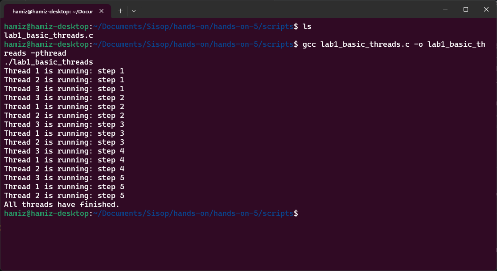

---

## Lab 2 - Race Condition on Shared Data

Segmen ini mendemonstrasikan kondisi balapan (*race condition*) ketika beberapa thread mengakses dan memodifikasi variabel bersama yang sama tanpa sinkronisasi. Tujuan utamanya adalah membantu mahasiswa memahami mengapa memori bersama antara thread dalam satu proses bersifat *powerful but dangerous* — komunikasi menjadi mudah, tetapi dapat menyebabkan ketidakkonsistenan data jika tidak dikelola dengan benar.

Program `lab2_race_condition.c` mendeklarasikan variabel global `int counter = 0`. Fungsi `increment_counter()` menjalankan loop sebanyak 1.000.000 iterasi, setiap iterasi melakukan operasi `counter++`. Dua thread dibuat dengan `pthread_create()`, masing-masing menjalankan fungsi `increment_counter()`. Setelah kedua thread selesai (dengan `pthread_join()`), program mencetak nilai counter yang diharapkan (2.000.000) dan nilai aktual. Operasi `counter++` terlihat sederhana, tetapi secara internal terdiri dari tiga langkah: (1) baca nilai counter dari memori ke register CPU, (2) tambah nilai register dengan 1, (3) tulis kembali nilai dari register ke memori. Jika dua thread melakukan langkah-langkah ini dalam waktu yang tumpang tindih, *lost update* dapat terjadi.

### Kesimpulan

Dengan menjalankan program beberapa kali, mahasiswa dapat mengamati bahwa nilai aktual counter hampir selalu kurang dari 2.000.000, dan hasilnya bervariasi antar eksekusi. Variasi ini adalah poin pembelajaran utama: *race condition* menghasilkan perilaku nondeterministik yang bergantung pada *timing* penjadwalan thread oleh sistem operasi. Program yang sama dapat menghasilkan output berbeda setiap kali dijalankan. Ini membuktikan bahwa tanpa *mutual exclusion*, operasi sederhana seperti `counter++` pun dapat menjadi tidak aman dalam lingkungan konkuren.

| Komponen | Isi |
| :--- | :--- |
| Filename | `lab2_race_condition.c` |
| Tools | `pthread_create`, `pthread_join`, `printf`, variabel global, GCC dengan flag `-pthread` |

### Snapshots Eksekusi

**Kompilasi dan eksekusi program (dijalankan beberapa kali untuk melihat variasi hasil):**
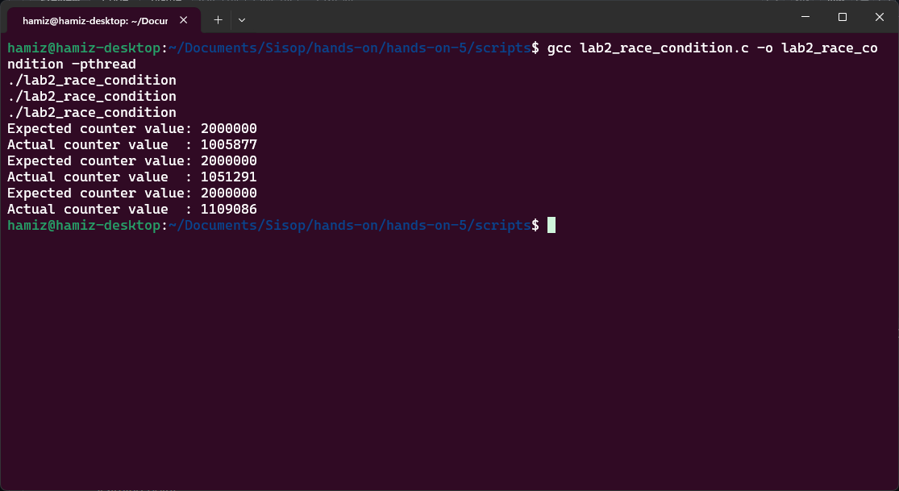

---

## Lab 3 - Solving the Race Condition with Mutual Exclusion

Segmen ini memperkenalkan *mutual exclusion* sebagai solusi untuk kondisi balapan (*race condition*) yang diamati pada Lab 2. Tujuan utamanya adalah menunjukkan bahwa dengan melindungi *critical section* (bagian kode yang mengakses data bersama), hanya satu thread yang diperbolehkan mengupdate data bersama pada satu waktu, sehingga kebenaran data dapat dipastikan.

Program `lab3_mutex_counter.c` mendeklarasikan variabel global `int counter = 0` dan sebuah mutex `pthread_mutex_t lock`. Di fungsi `main()`, mutex diinisialisasi dengan `pthread_mutex_init(&lock, NULL)`. Fungsi `increment_counter()` menjalankan loop sebanyak 1.000.000 iterasi, tetapi kali ini setiap iterasi membungkus operasi `counter++` dengan `pthread_mutex_lock(&lock)` sebelum increment dan `pthread_mutex_unlock(&lock)` sesudahnya. Ini memastikan bahwa operasi baca-modifikasi-tulis pada counter bersifat atomik dari perspektif thread lain — hanya satu thread yang boleh menjalankan *critical section* pada satu waktu. Thread lain yang mencoba mengunci mutex akan *blocked* hingga mutex tersedia. Setelah semua selesai, `pthread_mutex_destroy(&lock)` membersihkan mutex.

### Kesimpulan

Dengan mekanisme mutex, mahasiswa dapat mengamati bahwa nilai aktual counter sekarang konsisten mencapai 2.000.000 setiap kali program dijalankan. Mutex memaksa operasi increment berperilaku seperti *critical section* yang tak terbagi (indivisible). Hasilnya menjadi stabil dan benar. Ini mengilustrasikan prinsip penting dalam sistem operasi: sumber daya bersama harus dilindungi dari akses bersamaan yang saling bertentangan. Namun, perlu dipahami bahwa ini datang dengan *trade-off* — operasi increment menjadi terserialisasi, yang berarti hanya satu thread yang dapat mengeksekusi bagian tersebut pada satu waktu.

| Komponen | Isi |
| :--- | :--- |
| Filename | `lab3_mutex_counter.c` |
| Tools | `pthread_mutex_t`, `pthread_mutex_init`, `pthread_mutex_lock`, `pthread_mutex_unlock`, `pthread_mutex_destroy`, GCC dengan flag `-pthread` |

### Snapshots Eksekusi

**Kompilasi dan eksekusi program dengan mutex (hasil konsisten dan benar):**
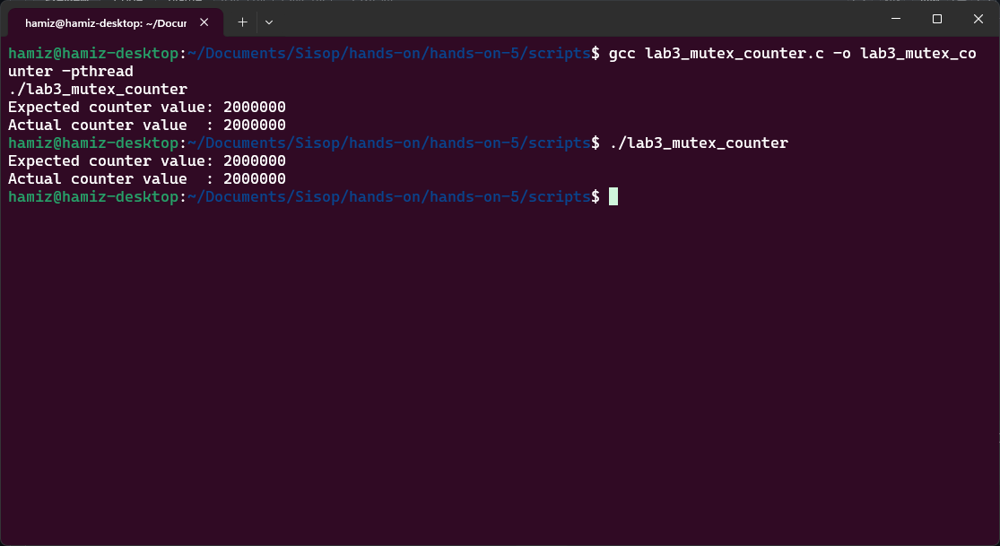

---

## Lab 4 - Producer-Consumer Using Semaphore Synchronization

Segmen ini mendemonstrasikan sinkronisasi antar thread menggunakan pola *producer-consumer*. Tujuan utamanya adalah menunjukkan bahwa sinkronisasi tidak hanya tentang melindungi data bersama, tetapi juga tentang mengkoordinasikan urutan eksekusi antar thread — *producer* harus menunggu jika buffer penuh, dan *consumer* harus menunggu jika buffer kosong.

Program `lab4_producer_consumer.c` mengimplementasikan buffer bersama berukuran satu (single-slot buffer). Dua semaphore digunakan untuk koordinasi: `empty` (dengan nilai awal 1) menandakan bahwa buffer kosong dan siap diisi, sedangkan `full` (dengan nilai awal 0) menandakan bahwa buffer berisi data dan siap dikonsumsi. Sebuah mutex `lock` melindungi akses aktual ke buffer. Fungsi `producer()` memproduksi item dari 1 hingga 10, setiap kali memanggil `sem_wait(&empty)` untuk menunggu buffer kosong, kemudian mengunci mutex, mengisi buffer, mencetak pesan, melepas mutex, lalu memanggil `sem_post(&full)` untuk memberi tahu consumer bahwa data tersedia. Fungsi `consumer()` melakukan kebalikannya: `sem_wait(&full)` untuk menunggu data tersedia, membaca buffer, lalu `sem_post(&empty)` untuk memberi tahu producer bahwa buffer kosong. Kedua thread berjalan bersamaan dengan `sleep(1)` untuk memperlambat eksekusi agar lebih mudah diamati.

### Kesimpulan

Dengan program ini, mahasiswa dapat mengamati bahwa setiap item yang diproduksi dikonsumsi tepat satu kali, dan urutannya terjaga dengan sempurna (1 dikonsumsi setelah 1 diproduksi, 2 setelah 2, dst). Consumer tidak pernah mengonsumsi sebelum producer memproduksi, dan producer tidak pernah menimpa buffer sebelum consumer mengonsumsi item sebelumnya. Ini menunjukkan dua peran sinkronisasi yang berbeda: semaphore mengelola *ordering* dan *blocking*, sementara mutex melindungi *critical section* untuk akses buffer. Pola *producer-consumer* ini sangat umum dalam sistem nyata, seperti antrian tugas, pipa data, atau buffer jaringan.

| Komponen | Isi |
| :--- | :--- |
| Filename | `lab4_producer_consumer.c` |
| Tools | `sem_t`, `sem_init`, `sem_wait`, `sem_post`, `sem_destroy`, `pthread_mutex_t`, `sleep`, GCC dengan flag `-pthread` |

### Snapshots Eksekusi

**Kompilasi dan eksekusi program producer-consumer (sinkronasi sempurna):**
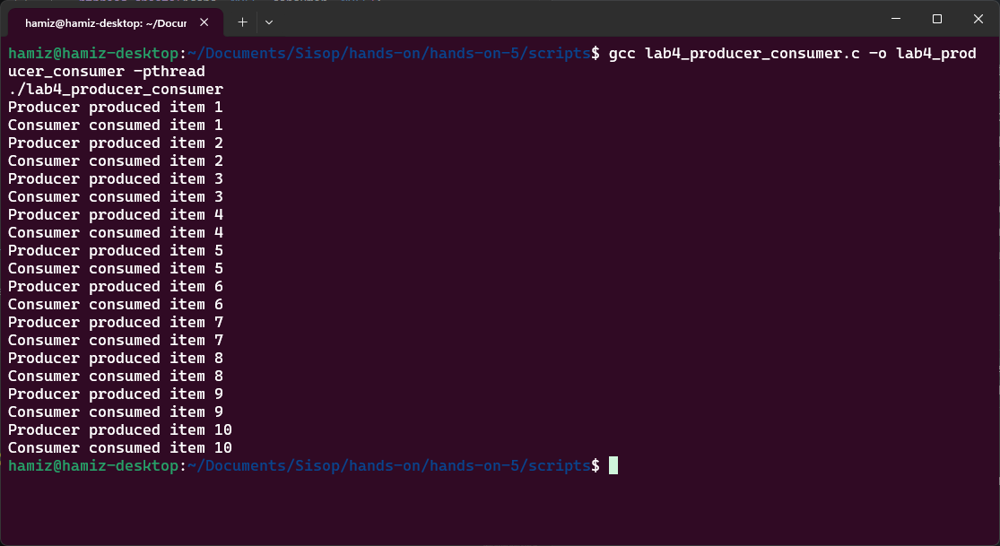

---

## Lab 5 - Blocking and Unblocking Threads with Condition Variables

Segmen ini mendemonstrasikan perilaku *blocking* dalam sinkronisasi thread menggunakan *condition variables*. Tujuan utamanya adalah menunjukkan bagaimana sebuah thread dapat secara sukarela menunggu (*wait*) hingga suatu kondisi yang diperlukan menjadi benar, dan bagaimana thread lain dapat memberinya sinyal (*signal*) untuk melanjutkan eksekusi — tanpa perlu *busy waiting* yang membuang waktu CPU.

Program `lab5_blocking_condition.c` mendeklarasikan variabel bersama `data_ready` (flag kondisi) dan `shared_data` (data yang akan dikirim), serta sebuah mutex `lock` dan condition variable `condition`. Fungsi `worker()` (thread pekerja) mengunci mutex, lalu memasuki loop `while (!data_ready)` dan memanggil `pthread_cond_wait(&condition, &lock)`. Panggilan ini secara atomik melepas mutex dan menempatkan thread dalam keadaan *blocked* hingga mendapatkan sinyal. Fungsi `controller()` (thread pengontrol) tidur selama 3 detik (mensimulasikan waktu persiapan data), kemudian mengunci mutex, mengisi `shared_data = 42`, men-set `data_ready = 1`, lalu memanggil `pthread_cond_signal(&condition)` untuk membangunkan thread pekerja yang sedang menunggu, dan akhirnya melepas mutex. Setelah terbangun, thread pekerja melanjutkan eksekusi, mencetak data yang diterima, dan melepas mutex.

### Kesimpulan

Dengan program ini, mahasiswa dapat mengamati bahwa thread pekerja pertama kali mencetak "Worker: data is not ready, blocking now..." dan kemudian berhenti (*blocked*). Setelah sekitar 3 detik, thread pengontrol mencetak "Controller: data prepared, signaling worker..." dan thread pekerja terbangun lalu mencetak "Worker: awakened, received shared data = 42". Observasi pentingnya adalah bahwa thread pekerja **tidak** secara terus-menerus memeriksa variabel dalam loop yang membuang-buang CPU (*busy waiting*). Sebaliknya, ia masuk ke keadaan *blocked* hingga mendapatkan sinyal. Ini menghubungkan konsep *thread states* (running, ready, blocked) dari teori sistem operasi dengan implementasi konkret menggunakan condition variables — sebuah mekanisme sinkronisasi yang efisien untuk koordinasi berbasis kondisi.

| Komponen | Isi |
| :--- | :--- |
| Filename | `lab5_blocking_condition.c` |
| Tools | `pthread_cond_t`, `pthread_cond_init`, `pthread_cond_wait`, `pthread_cond_signal`, `pthread_cond_destroy`, `pthread_mutex_t`, `sleep`, GCC dengan flag `-pthread` |

### Snapshots Eksekusi

**Kompilasi dan eksekusi program dengan condition variable (blocking dan signaling):**
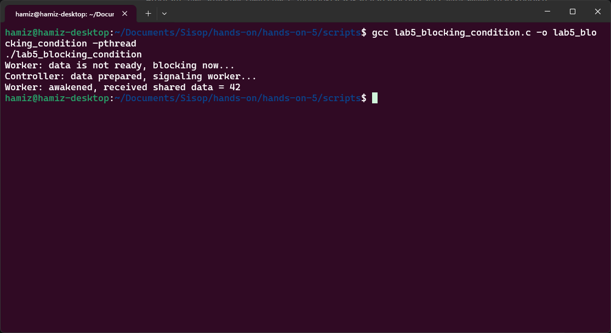

---

## Lab 6 - Implementing a Critical Section with Threads (Bank Account Balance)

Segmen ini mengajarkan cara mengidentifikasi dan mengimplementasikan *critical section* dalam program multithread menggunakan studi kasus saldo rekening bank. Tujuan utamanya adalah membantu mahasiswa memahami bahwa *critical section* bukanlah keseluruhan program, melainkan hanya bagian kode di mana data bersama diakses dan dimodifikasi — dan bagian inilah yang harus dilindungi.

Program `critical_section_bank.c` mendeklarasikan variabel global `int balance = 0` dan sebuah mutex `balance_lock`. Fungsi `deposit_money()` menerima ID thread sebagai argumen, lalu menjalankan loop sebanyak `DEPOSITS_PER_THREAD` (3 kali) dengan nilai deposit `DEPOSIT_AMOUNT` (100). Di dalam loop, *critical section* dimulai dengan `pthread_mutex_lock(&balance_lock)`. Thread membaca `old_balance` saat ini, mencetaknya, kemudian `sleep(1)` sengaja ditambahkan untuk memperlambat eksekusi sehingga efek konkurensi lebih mudah diamati. Setelah itu, thread menghitung `balance = old_balance + DEPOSIT_AMOUNT`, mencetak nilai baru, lalu memanggil `pthread_mutex_unlock(&balance_lock)` untuk melepas kunci. Di `main()`, 5 thread dibuat dan dijalankan secara bersamaan. Setelah semua thread selesai, program mencetak saldo akhir dan membandingkannya dengan nilai yang diharapkan (5 thread × 3 deposit × 100 = 1500).

### Kesimpulan

Dengan program ini, mahasiswa dapat mengamati bahwa hanya satu thread pada satu waktu yang membaca dan mengupdate saldo. Pesan seperti "Thread X reads balance: Y" dan "Thread X updates balance to: Z" muncul secara berurutan tanpa tumpang tindih antar thread. Meskipun banyak thread yang eksis, update saldo terjadi dalam urutan yang terkendali. Saldo akhir selalu mencapai 1500 — nilai yang benar. Ini mendemonstrasikan *mutual exclusion*: data bersama dilindungi sehingga eksekusi konkuren tidak menghasilkan hasil yang inkonsisten. Kasus simulasi transaksi bank ini sangat relevan dengan dunia nyata, di mana dua transaksi ATM yang bersamaan tidak boleh merusak saldo rekening.

| Komponen | Isi |
| :--- | :--- |
| Filename | `critical_section_bank.c` |
| Tools | `pthread_mutex_t`, `pthread_mutex_init`, `pthread_mutex_lock`, `pthread_mutex_unlock`, `pthread_mutex_destroy`, `printf`, `sleep`, GCC dengan flag `-pthread` |

### Snapshots Eksekusi

**Kompilasi dan eksekusi program critical section pada rekening bank:**
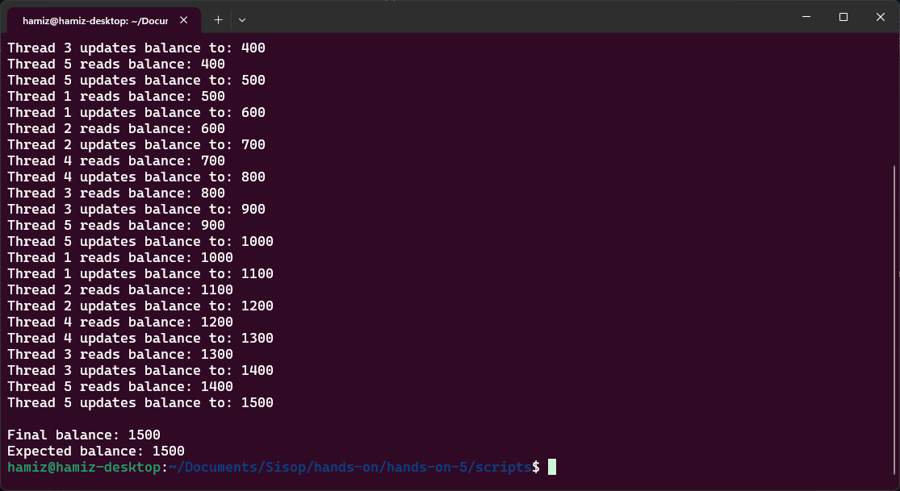

---

## Lab 7 - Observing a Race Condition

Segmen ini bertujuan untuk mendemonstrasikan bagaimana thread konkuren yang mengakses data bersama tanpa sinkronisasi dapat menghasilkan hasil yang tidak benar. Tujuan utamanya adalah membantu mahasiswa belajar mengidentifikasi *race condition* dan memahami bahwa operasi yang tampak sederhana sekalipun dapat menjadi tidak aman dalam lingkungan konkuren.

Program `lab1_race.c` (dinamakan demikian dalam dokumentasi, meskipun merupakan lab ke-7 dalam urutan) mendeklarasikan variabel global `int counter = 0`. Fungsi `increment()` menjalankan loop sebanyak 1.000.000 iterasi, setiap iterasi melakukan operasi `counter++`. Dua thread dibuat dengan `pthread_create()`, masing-masing menjalankan fungsi `increment()`. Setelah kedua thread selesai (dengan `pthread_join()`), program mencetak nilai counter yang diharapkan (2.000.000) dan nilai aktual. Operasi `counter++` terlihat sederhana, tetapi di tingkat mesin terdiri dari tiga langkah: baca nilai dari memori ke register, tambah register dengan 1, tulis kembali ke memori. Tanpa perlindungan, dua thread dapat membaca nilai yang sama sebelum salah satunya menulis kembali, menyebabkan *lost update*.

### Kesimpulan

Dengan menjalankan program beberapa kali, mahasiswa dapat mengamati bahwa nilai aktual counter hampir selalu kurang dari 2.000.000. Bahaya dari *race condition* ini bersifat *subtle* karena kode terlihat benar secara logika — tidak ada kesalahan sintaks atau kesalahan algoritma yang jelas. Namun, karena eksekusi bersifat konkuren dan timing penjadwalan tidak dapat diprediksi, hasilnya menjadi tidak konsisten. Ini membuktikan bahwa tanpa *mutual exclusion*, program multithread dapat menghasilkan output yang berbeda setiap kali dijalankan. Kesalahan seperti ini sulit dideteksi dalam pengujian biasa karena mungkin kadang-kadang menghasilkan nilai yang benar, memberikan rasa aman palsu.

| Komponen | Isi |
| :--- | :--- |
| Filename | `lab1_race.c` |
| Tools | `pthread_create`, `pthread_join`, `printf`, variabel global, GCC dengan flag `-pthread` |

### Snapshots Eksekusi

**Kompilasi dan eksekusi program race condition (dijalankan beberapa kali):**
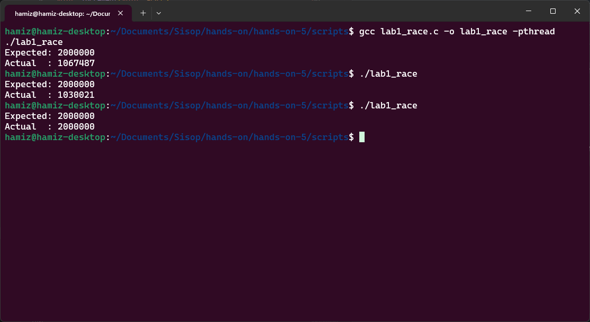

---

## Lab 8 - Implementing Mutual Exclusion with Mutex

Segmen ini bertujuan untuk menghilangkan *race condition* dengan menerapkan *mutual exclusion* menggunakan *lock* (mutex). Tujuan utamanya adalah menunjukkan bahwa sinkronasi memastikan perilaku yang dapat diprediksi (*predictable behavior*) ketika beberapa thread mengakses data bersama, dan bahwa *critical section* harus dilindungi agar hanya satu thread yang dapat mengeksekusinya pada satu waktu.

Program `lab2_mutex.c` (dinamakan demikian dalam dokumentasi, meskipun merupakan lab ke-8 dalam urutan) mendeklarasikan variabel global `int counter = 0` dan sebuah mutex `pthread_mutex_t lock`. Di fungsi `main()`, mutex diinisialisasi dengan `pthread_mutex_init(&lock, NULL)`. Fungsi `increment()` menjalankan loop sebanyak 1.000.000 iterasi, dan setiap iterasi membungkus operasi `counter++` dengan `pthread_mutex_lock(&lock)` sebelum increment dan `pthread_mutex_unlock(&lock)` sesudahnya. Dua thread dibuat dan dijalankan secara bersamaan. Mutex bertindak seperti sebuah *gate*: thread harus mengakuisisi lock sebelum memasuki *critical section* dan melepaskannya setelah keluar. Thread yang mencoba mengunci mutex yang sedang dipegang thread lain akan *blocked* hingga mutex tersedia. Setelah semua thread selesai, `pthread_mutex_destroy(&lock)` membersihkan mutex.

### Kesimpulan

Dengan mekanisme mutex, mahasiswa dapat mengamati bahwa nilai aktual counter sekarang selalu mencapai 2.000.000 — hasil yang benar dan konsisten setiap kali program dijalankan. Berbeda dengan Lab 7 yang hasilnya bervariasi dan tidak dapat diprediksi, Lab 8 menunjukkan bahwa sinkronisasi memastikan *predictable behavior* dalam program konkuren. Mutex tidak menghilangkan konkurensi dari keseluruhan program, tetapi hanya mengontrol akses ke bagian kritis (*critical section*) tempat data bersama dimodifikasi. Ini adalah prinsip fundamental dalam desain sistem operasi: lindungi data bersama, izinkan sisanya tetap berjalan secara konkuren.

| Komponen | Isi |
| :--- | :--- |
| Filename | `lab2_mutex.c` |
| Tools | `pthread_mutex_t`, `pthread_mutex_init`, `pthread_mutex_lock`, `pthread_mutex_unlock`, `pthread_mutex_destroy`, GCC dengan flag `-pthread` |

### Snapshots Eksekusi

**Kompilasi dan eksekusi program dengan mutex (hasil konsisten dan benar):**
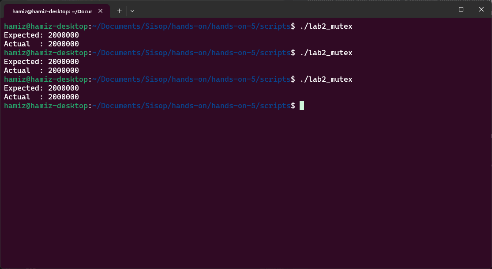

---

## Lab 9 - Semaphore-Based Mutual Exclusion

Segmen ini mengimplementasikan *mutual exclusion* menggunakan semaphore sebagai alternatif dari mutex. Tujuan utamanya adalah menunjukkan bahwa semaphore — yang merupakan alat sinkronisasi lebih umum dalam sistem operasi — juga dapat digunakan untuk melindungi *critical section* dengan cara yang mirip dengan mutex, namun memiliki aplikasi yang lebih luas (seperti sinkronisasi producer-consumer yang telah dilihat pada Lab 4).

Program `lab3_semaphore.c` mendeklarasikan variabel global `int counter = 0` dan sebuah semaphore `sem_t sem`. Di fungsi `main()`, semaphore diinisialisasi dengan `sem_init(&sem, 0, 1)` — nilai awal 1 menunjukkan bahwa semaphore bersifat biner (hanya bernilai 0 atau 1) dan dalam keadaan "tidak terkunci". Fungsi `increment()` menjalankan loop sebanyak 1.000.000 iterasi. Setiap iterasi memanggil `sem_wait(&sem)` yang berfungsi seperti `lock`: jika nilai semaphore > 0, nilai dikurangi dan thread melanjutkan; jika nilai semaphore = 0, thread *blocked* hingga nilainya menjadi positif. Setelah operasi `counter++` selesai, `sem_post(&sem)` dipanggil untuk menambah nilai semaphore (melepas kunci), memungkinkan thread lain yang menunggu untuk melanjutkan. Dua thread dibuat dan dijalankan secara bersamaan. Setelah selesai, `sem_destroy(&sem)` membersihkan semaphore.

### Kesimpulan

Dengan program ini, mahasiswa dapat mengamati bahwa nilai akhir counter selalu mencapai 2.000.000 — hasil yang benar dan konsisten, sama seperti ketika menggunakan mutex pada Lab 8. Ini membuktikan bahwa *binary semaphore* (semaphore dengan nilai awal 1) dapat berfungsi sebagai *lock* untuk melindungi *critical section*. Perbedaan konseptualnya adalah: mutex memiliki konsep *ownership* (hanya thread yang mengunci yang boleh melepas kunci), sedangkan semaphore lebih fleksibel karena operasi `wait` dan `signal` dapat dilakukan oleh thread yang berbeda. Fleksibilitas inilah yang membuat semaphore berguna untuk pola sinkronisasi yang lebih kompleks seperti producer-consumer. Mahasiswa belajar bahwa ada lebih dari satu cara untuk mencapai *mutual exclusion* dalam sistem operasi.

| Komponen | Isi |
| :--- | :--- |
| Filename | `lab3_semaphore.c` |
| Tools | `sem_t`, `sem_init`, `sem_wait`, `sem_post`, `sem_destroy`, GCC dengan flag `-pthread` |

### Snapshots Eksekusi

**Kompilasi dan eksekusi program dengan semaphore-based mutual exclusion:**
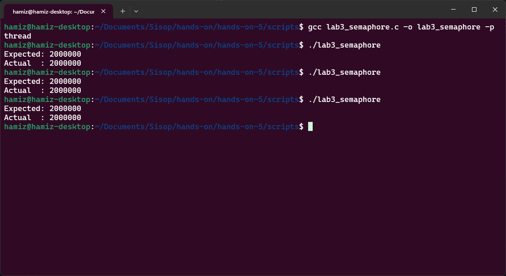

---

## Lab 10 - Producer-Consumer Synchronization

Segmen ini mengimplementasikan koordinasi antara dua thread menggunakan pola *producer-consumer* dengan semaphore. Tujuan utamanya adalah menunjukkan bahwa sinkronisasi diperlukan tidak hanya untuk melindungi data bersama (mutual exclusion), tetapi juga untuk mengatur urutan eksekusi antar thread sehingga producer tidak menimpa data yang belum dikonsumsi dan consumer tidak membaca data dari buffer kosong.

Program `lab4_producer_consumer.c` (dalam dokumentasi ini merupakan lab ke-10) mengimplementasikan buffer bersama berukuran satu. Dua semaphore digunakan: `empty` (nilai awal 1) menandakan buffer kosong dan siap diisi, `full` (nilai awal 0) menandakan buffer berisi data dan siap dikonsumsi. Sebuah mutex `lock` melindungi akses aktual ke buffer. Fungsi `producer()` memproduksi item 1 sampai 5, setiap kali memanggil `sem_wait(&empty)` untuk menunggu buffer kosong, mengunci mutex, mengisi buffer, mencetak "Produced: X", melepas mutex, lalu `sem_post(&full)` untuk memberi sinyal bahwa data tersedia. Fungsi `consumer()` memanggil `sem_wait(&full)` untuk menunggu data tersedia, mengunci mutex, membaca buffer, mencetak "Consumed: X", melepas mutex, lalu `sem_post(&empty)` untuk memberi sinyal bahwa buffer kosong. `sleep(1)` memperlambat eksekusi agar mudah diamati.

### Kesimpulan

Dengan program ini, mahasiswa dapat mengamati bahwa produksi dan konsumsi terjadi secara bergantian (*strict alternation*): item 1 diproduksi lalu dikonsumsi, item 2 diproduksi lalu dikonsumsi, dan seterusnya hingga item 5. Tidak pernah terjadi producer menimpa buffer sebelum item dikonsumsi, dan tidak pernah terjadi consumer membaca buffer kosong. Ini menunjukkan bahwa sinkronasi dengan semaphore mampu mengatur *ordering* (urutan) eksekusi antar thread — sebuah kebutuhan yang melampaui sekadar *mutual exclusion*. Pola producer-consumer ini sangat umum dalam sistem nyata seperti antrian tugas, pipa pemrosesan data, buffer jaringan, dan sistem antrian pesan.

| Komponen | Isi |
| :--- | :--- |
| Filename | `lab4_producer_consumer.c` |
| Tools | `sem_t`, `sem_init`, `sem_wait`, `sem_post`, `pthread_mutex_t`, `sleep`, GCC dengan flag `-pthread` |

### Snapshots Eksekusi

**Kompilasi dan eksekusi program producer-consumer:**
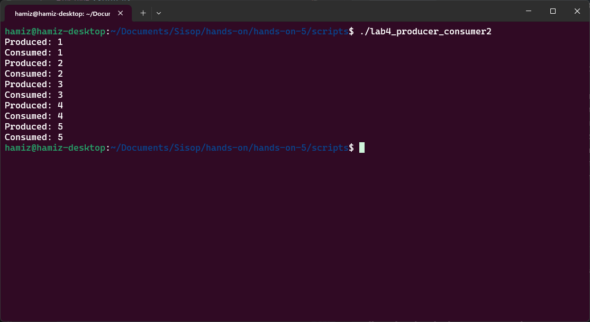

---

## Lab 11 - Readers-Writers Problem

Segmen ini mengeksplorasi skenario di mana beberapa *reader* dapat mengakses data secara bersamaan, tetapi *writer* memerlukan akses eksklusif. Tujuan utamanya adalah menunjukkan bahwa dalam sistem nyata (basis data, sistem file, struktur memori bersama), mengizinkan banyak pembaca secara simultan meningkatkan kinerja, namun penulis harus dilindungi agar tidak ada konflik baca/tulis atau tulis/tulis.

Program `lab5_readers_writers.c` mengimplementasikan solusi untuk *readers-writers problem* menggunakan dua mutex. `read_count` menghitung berapa banyak reader yang sedang mengakses data. `mutex` melindungi akses ke variabel `read_count`. `write_lock` digunakan untuk memastikan hanya satu writer (atau tidak ada reader saat writer menulis) yang dapat mengakses data. Fungsi `reader()`: mengunci `mutex`, menambah `read_count`, jika ini adalah reader pertama (`read_count == 1`), maka ia mengunci `write_lock` (mencegah writer masuk). Setelah melepas `mutex`, reader membaca data (simulasi dengan `sleep(1)`). Kemudian reader mengunci `mutex` lagi, mengurangi `read_count`, jika ini adalah reader terakhir (`read_count == 0`), ia melepas `write_lock` (mengizinkan writer). Fungsi `writer()`: langsung mengunci `write_lock` (menunggu jika ada reader atau writer lain), menulis data (simulasi dengan `sleep(2)`), lalu melepas `write_lock`.

### Kesimpulan

Dengan program ini, mahasiswa dapat mengamati bahwa dua thread reader dapat berjalan secara bersamaan (konkuren), sementara writer berjalan sendirian tanpa interupsi. Dalam contoh eksekusi, kedua reader membaca secara simultan, kemudian writer menulis. Ini menunjukkan *controlled concurrency*: kebijakan sinkronasi yang berbeda diterapkan untuk tipe thread yang berbeda. *Readers-writers problem* adalah masalah klasik dalam sistem operasi yang mengajarkan bahwa sinkronisasi tidak selalu "satu ukuran untuk semua" — kebijakan dapat disesuaikan dengan kebutuhan pola akses data.

| Komponen | Isi |
| :--- | :--- |
| Filename | `lab5_readers_writers.c` |
| Tools | `pthread_mutex_t`, `pthread_mutex_init`, `pthread_mutex_lock`, `pthread_mutex_unlock`, `sleep`, GCC dengan flag `-pthread` |

### Snapshots Eksekusi

**Kompilasi dan eksekusi program readers-writers:**
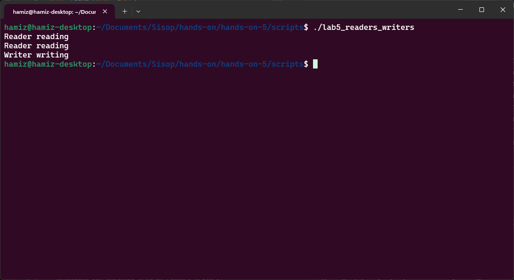