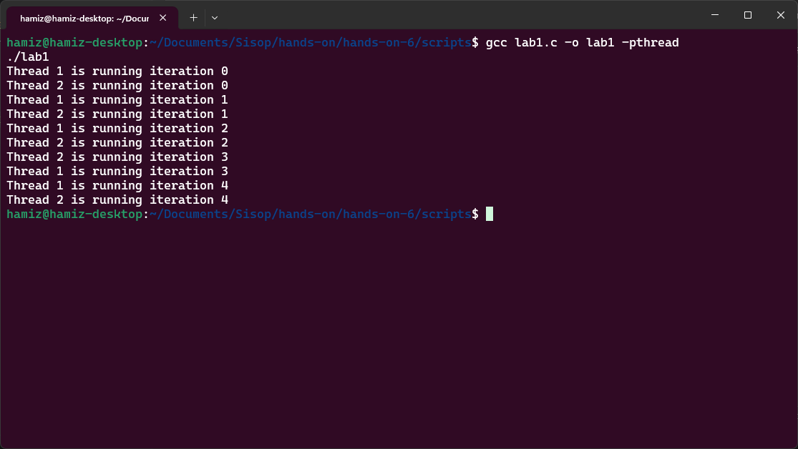
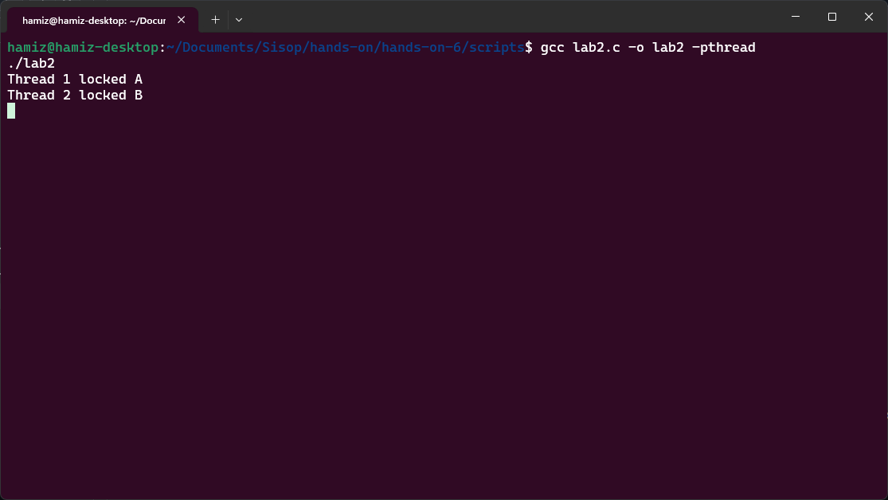
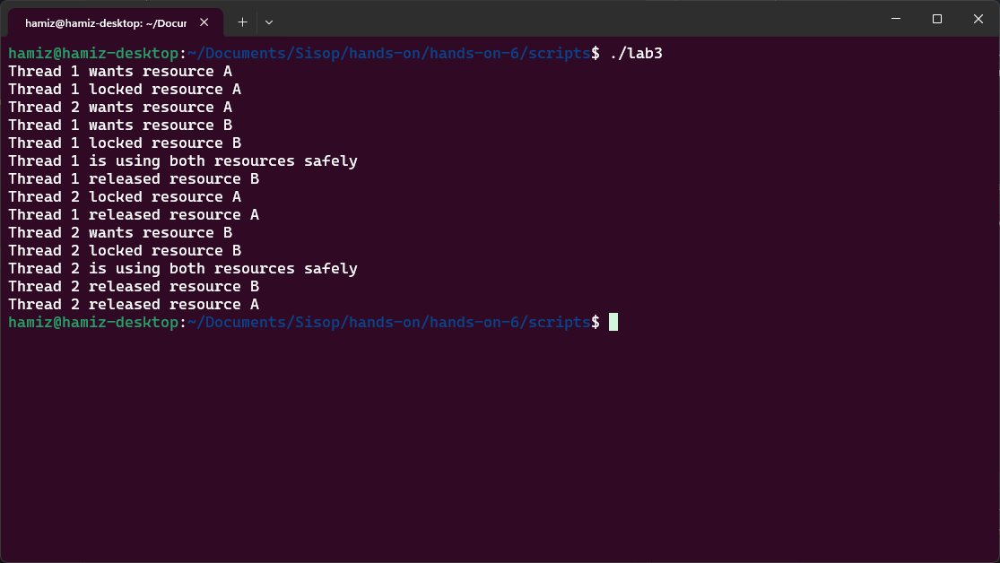
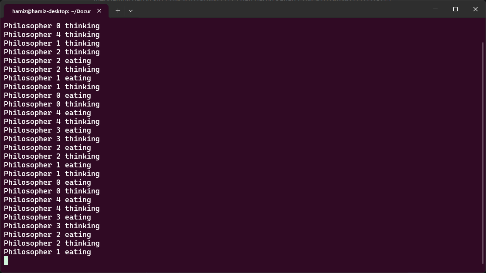
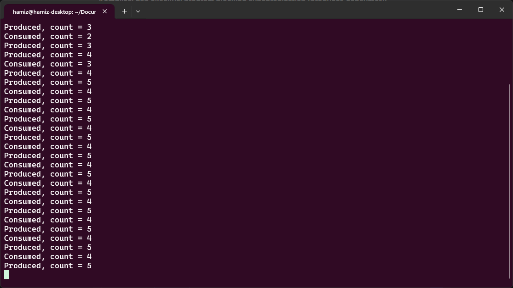

# Laporan Hands-On 6: Deadlock and Starvation

|    NRP     |           Nama             |
| :--------: |       :------------:       |
| 5025251246 | Hamizan Rifqi Afandi       |

---

## Lab 1 - Thread Concurrency and Resource Competition

Segmen ini memperkenalkan eksekusi thread konkuren dan konsep fundamental persaingan sumber daya (*resource competition*) tanpa menerapkan sinkronisasi. Tujuan utamanya adalah membantu mahasiswa memahami bahwa beberapa thread dapat mengeksekusi secara independen sambil berbagi sumber daya sistem, dan bahwa konkurensi tanpa koordinasi menghasilkan perilaku yang tidak terduga (*nondeterministic*).

Program `lab1.c` mengimplementasikan fungsi `task()` yang menerima ID thread sebagai argumen, lalu menjalankan loop sebanyak 5 iterasi. Setiap iterasi mencetak "Thread X is running iteration Y" dan tidur selama 1 detik (`sleep(1)`). Di fungsi `main()`, dua thread dibuat dengan `pthread_create()` dan dijalankan secara bersamaan. Tidak ada mekanisme sinkronisasi apa pun yang diterapkan. Urutan eksekusi sepenuhnya ditentukan oleh penjadwal (*scheduler*) sistem operasi. `pthread_join()` digunakan untuk menunggu kedua thread selesai.

### Kesimpulan

Dengan menjalankan program beberapa kali, mahasiswa dapat mengamati bahwa urutan output dari kedua thread tercampur secara tidak terduga. Terkadang Thread 1 mencetak lebih dulu, terkadang Thread 2. Ini mencerminkan sifat fundamental eksekusi konkuren: tidak ada jaminan urutan eksekusi kecuali ditegakkan secara eksplisit. Perilaku ini menjadi akar penyebab masalah yang lebih serius seperti *race condition*, *deadlock*, dan *starvation*. Seperti yang dijelaskan dalam bab tentang konkurensi, masalah muncul karena proses atau thread bersaing untuk mendapatkan sumber daya yang dapat digunakan ulang (*reusable resources*) seperti memori, file, atau perangkat I/O.

| Komponen | Isi |
| :--- | :--- |
| Filename | `lab1.c` |
| Tools | `pthread_create`, `pthread_join`, `printf`, `sleep`, GCC dengan flag `-pthread` |

### Snapshots Eksekusi

**Kompilasi dan eksekusi program dengan dua thread konkuren:**

---

## Lab 2 - Simulating Deadlock with Threads

Segmen ini memperkenalkan konsep *deadlock* (kebuntuan), yaitu situasi di mana sekumpulan proses atau thread terblokir secara permanen karena masing-masing menunggu sumber daya yang sedang dipegang oleh proses atau thread lain. Tujuan utamanya adalah mendemonstrasikan bagaimana urutan pengambilan sumber daya yang tidak tepat dapat menyebabkan deadlock.

Program `lab2.c` mengimplementasikan deadlock klasik menggunakan dua mutex (`A` dan `B`). Fungsi `thread1()` mengunci mutex `A` terlebih dahulu, mencetak "Thread 1 locked A", kemudian tidur selama 1 detik (`sleep(1)`), lalu mencoba mengunci mutex `B`. Fungsi `thread2()` melakukan kebalikannya: mengunci mutex `B` terlebih dahulu, mencetak "Thread 2 locked B", tidur 1 detik, lalu mencoba mengunci mutex `A`. Di fungsi `main()`, kedua thread dibuat dan dijalankan bersamaan. Deadlock terjadi karena Thread 1 memegang `A` sambil menunggu `B`, sementara Thread 2 memegang `B` sambil menunggu `A` — tidak ada thread yang mau melepaskan sumber daya yang dipegangnya.

### Kesimpulan

Dengan menjalankan program, mahasiswa dapat mengamati bahwa program akan membeku (hang) tanpa menghasilkan output "Thread 1 locked B" atau "Thread 2 locked A". Ini adalah demonstrasi deadlock yang jelas. Empat kondisi yang diperlukan untuk terjadinya deadlock (menurut teori sistem operasi) terpenuhi di sini: *mutual exclusion* (mutex hanya dapat dipegang satu thread), *hold-and-wait* (thread memegang satu sumber daya sambil menunggu sumber daya lain), *no preemption* (sumber daya tidak dapat diambil paksa), dan *circular wait* (Thread 1 menunggu sumber daya yang dipegang Thread 2, dan sebaliknya). Deadlock seperti ini dapat terjadi di dunia nyata, misalnya pada sistem basis data atau aplikasi multithread yang dirancang dengan buruk.

| Komponen | Isi |
| :--- | :--- |
| Filename | `lab2.c` |
| Tools | `pthread_mutex_t`, `pthread_mutex_lock`, `pthread_mutex_unlock`, `pthread_mutex_init`, `sleep`, GCC dengan flag `-pthread` |

### Snapshots Eksekusi

**Kompilasi dan eksekusi program yang mengalami deadlock:**

---

## Lab 3 - Deadlock Prevention via Resource Ordering

Segmen ini mendemonstrasikan **pencegahan deadlock** dengan menghilangkan salah satu kondisi yang diperlukan untuk terjadinya deadlock. Tujuan utamanya adalah menunjukkan bahwa dengan menerapkan urutan pengambilan sumber daya yang konsisten (strict ordering), kondisi *circular wait* dapat dihilangkan sehingga deadlock dapat dicegah.

Program `lab3.c` mengimplementasikan solusi pencegahan deadlock menggunakan **resource ordering**. Berbeda dengan Lab 2 di mana `thread1` mengambil A lalu B sementara `thread2` mengambil B lalu A, di sini kedua thread mengikuti urutan yang sama: selalu mengambil mutex `A` terlebih dahulu, baru kemudian mutex `B`. Fungsi `safe_thread()` menerima ID thread, mencetak keinginan untuk mengambil A, mengunci A, kemudian tidur selama 1 detik (mensimulasikan work), lalu mengambil B, menggunakan kedua sumber daya, melepas B, dan terakhir melepas A. Kedua thread mengikuti urutan yang persis sama, sehingga tidak pernah terjadi kondisi saling menunggu melingkar (circular wait).

### Kesimpulan

Dengan menjalankan program, mahasiswa dapat mengamati bahwa program berjalan dengan sukses tanpa deadlock. Output menunjukkan kedua thread berhasil mengambil kedua sumber daya secara bergantian dengan aman. Ini membuktikan bahwa dengan **memaksakan urutan pengambilan sumber daya yang konsisten**, kondisi circular wait — salah satu dari empat kondisi yang diperlukan untuk deadlock — dapat dihilangkan. Dalam sistem operasi nyata, strategi ini sering digunakan pada manajemen sumber daya database, sistem file, dan kernel locking untuk memastikan alokasi sumber daya yang aman. Pendekatan ini lebih praktis dibandingkan metode pencegahan deadlock lainnya karena relatif mudah diimplementasikan selama urutan sumber daya dapat ditentukan secara global.

| Komponen | Isi |
| :--- | :--- |
| Filename | `lab3.c` |
| Tools | `pthread_mutex_t`, `pthread_mutex_lock`, `pthread_mutex_unlock`, `pthread_mutex_init`, `pthread_mutex_destroy`, `sleep`, GCC dengan flag `-pthread` |

### Snapshots Eksekusi

**Kompilasi dan eksekusi program dengan resource ordering (deadlock prevention):**

---

## Lab 4 - Dining Philosophers with Semaphores

Segmen ini mengeksplorasi masalah klasik **Dining Philosophers** yang mengilustrasikan tantangan sinkronisasi dan deadlock dalam sistem konkuren. Tujuan utamanya adalah memodelkan skenario dunia nyata di mana beberapa thread (filsuf) bersaing untuk mendapatkan sumber daya bersama (garpu) dengan risiko deadlock atau starvation.

Program `lab4.c` mengimplementasikan masalah 5 filsuf yang duduk melingkar, masing-masing membutuhkan 2 garpu (kiri dan kanan) untuk makan. Setiap garpu direpresentasikan sebagai semaphore biner (`sem_t forks[5]`) dengan nilai awal 1. Fungsi `philosopher()` menerima nomor filsuf (0-4), kemudian dalam loop tak terbatas: filsuf berpikir (`thinking`) selama 1 detik, lalu mengambil garpu kiri (`sem_wait(&forks[i])`) dan garpu kanan (`sem_wait(&forks[(i+1)%5])`), kemudian makan (`eating`) selama 1 detik, lalu melepaskan kedua garpu (`sem_post`). Di fungsi `main()`, 5 thread filsuf dibuat dan dijalankan secara bersamaan.

### Kesimpulan

Dengan menjalankan program, mahasiswa dapat mengamati bahwa tergantung pada penjadwalan, program dapat mengalami **deadlock** (jika semua filsuf mengambil garpu kiri secara bersamaan) atau **starvation** (beberapa filsuf tidak pernah mendapat giliran makan). Ini secara langsung mencerminkan diskusi dalam teori sistem operasi tentang Dining Philosophers Problem dan solusi berbasis semaphore. Masalah ini relevan dengan skenario dunia nyata seperti penguncian basis data, akses jaringan, atau alokasi sumber daya dalam sistem terdistribusi. Solusi yang lebih canggih (misalnya mengambil kedua garpu secara atomik atau menggunakan semaphore pengawas) diperlukan untuk menghindari deadlock sambil tetap menjamin kelaparan tidak terjadi.

| Komponen | Isi |
| :--- | :--- |
| Filename | `lab4.c` |
| Tools | `sem_t`, `sem_init`, `sem_wait`, `sem_post`, `pthread_create`, `pthread_join`, `sleep`, GCC dengan flag `-pthread` |

### Snapshots Eksekusi

**Kompilasi dan eksekusi program Dining Philosophers (dapat mengalami deadlock):**

---

## Lab 5 - Blocking Synchronization using Semaphores

Segmen ini memperkenalkan **blocking synchronization** menggunakan semaphore, di mana thread menunggu secara efisien tanpa *busy-waiting* (membuang waktu CPU dengan pemeriksaan berulang). Tujuan utamanya adalah menunjukkan bahwa dengan blocking, sistem operasi dapat menangguhkan (*suspend*) thread yang menunggu sehingga CPU dapat dialokasikan ke thread lain yang siap bekerja, meningkatkan efisiensi sistem secara keseluruhan.

Program `lab5.c` mengimplementasikan pola **Producer-Consumer** dengan buffer berukuran 5 menggunakan tiga semaphore. `empty` (nilai awal = SIZE = 5) menghitung jumlah slot kosong dalam buffer. `full` (nilai awal = 0) menghitung jumlah item yang tersedia dalam buffer. `mutex` (nilai awal = 1) bertindak sebagai binary semaphore untuk melindungi akses ke *critical section* (buffer dan variabel `count`). Fungsi `producer()` dalam loop tak terbatas: menunggu slot kosong (`sem_wait(&empty)`), masuk critical section, menambahkan item ke buffer, mencetak jumlah item (`count`), keluar critical section, lalu memberi sinyal bahwa item tersedia (`sem_post(&full)`). Fungsi `consumer()` melakukan kebalikannya: menunggu item tersedia (`sem_wait(&full)`), mengambil item, lalu memberi sinyal slot kosong (`sem_post(&empty)`). Producer tidur 1 detik, consumer tidur 2 detik untuk simulasi.

### Kesimpulan

Dengan menjalankan program, mahasiswa dapat mengamati bahwa producer dan consumer bekerja secara harmonis tanpa saling memblokir secara permanen. Ketika buffer penuh, producer akan *blocked* (ditangguhkan) hingga consumer mengambil item. Ketika buffer kosong, consumer akan *blocked* hingga producer memproduksi item. Ini adalah contoh **blocking synchronization** yang efisien — thread menunggu dalam keadaan *blocked*, bukan *busy-waiting*. Seperti yang dibahas dalam teori sistem operasi, blocking synchronization memungkinkan CPU beralih ke thread lain yang siap, menghindari pemborosan waktu prosesor. Implementasi producer-consumer ini menjadi fondasi untuk sistem antrian tugas, pipeline pemrosesan data, dan buffer jaringan dalam sistem nyata.

| Komponen | Isi |
| :--- | :--- |
| Filename | `lab5.c` |
| Tools | `sem_t`, `sem_init`, `sem_wait`, `sem_post`, `sem_destroy`, `pthread_create`, `pthread_join`, `sleep`, GCC dengan flag `-pthread` |

### Snapshots Eksekusi

**Kompilasi dan eksekusi program blocking synchronization (producer-consumer):**
